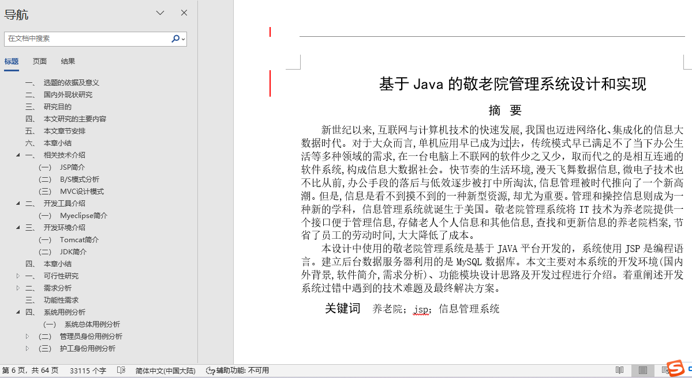
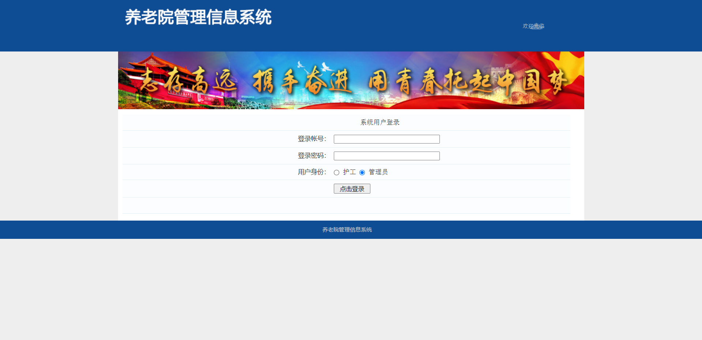
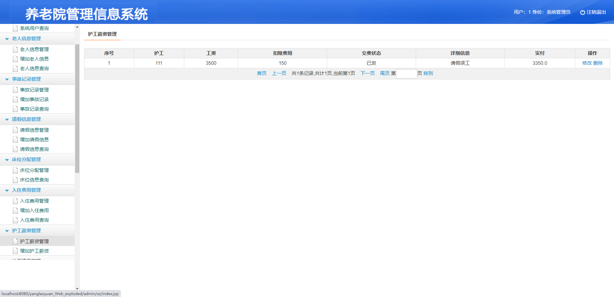
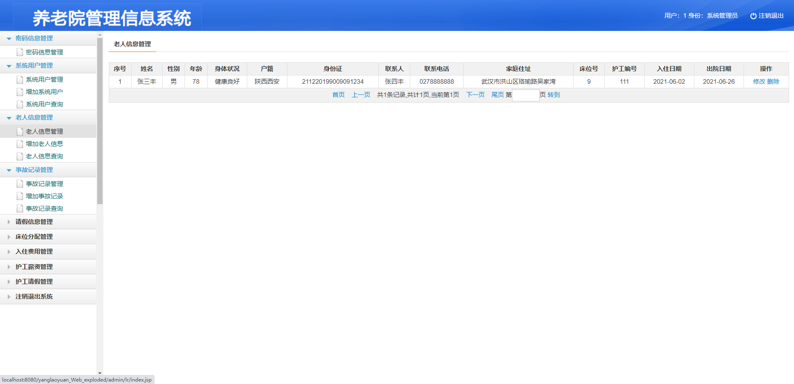
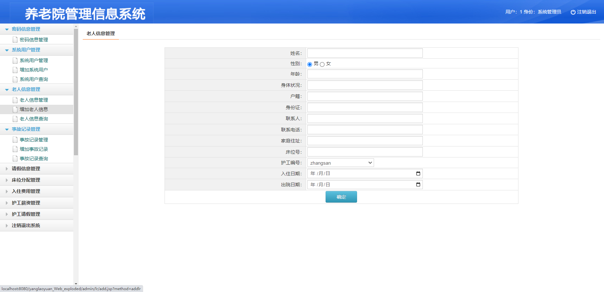
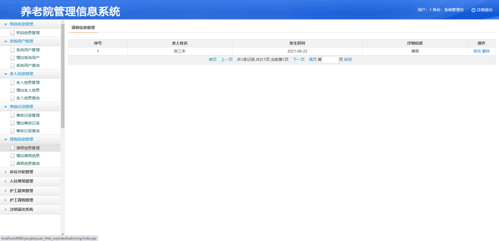
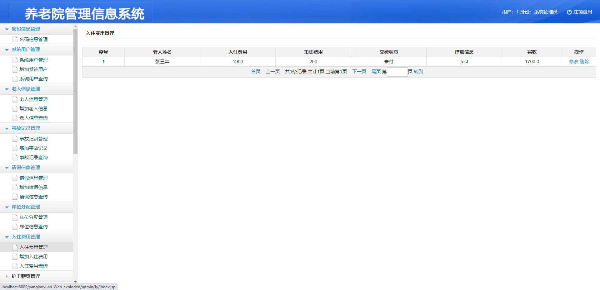
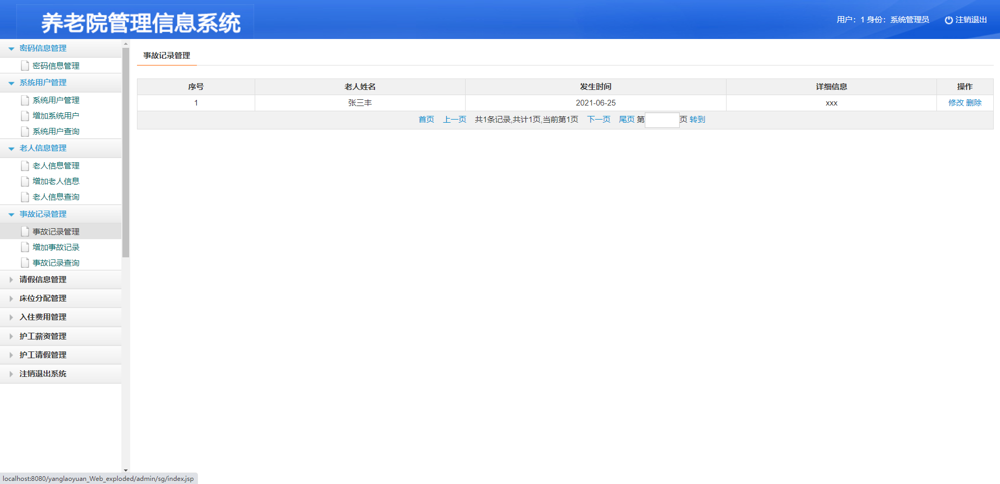
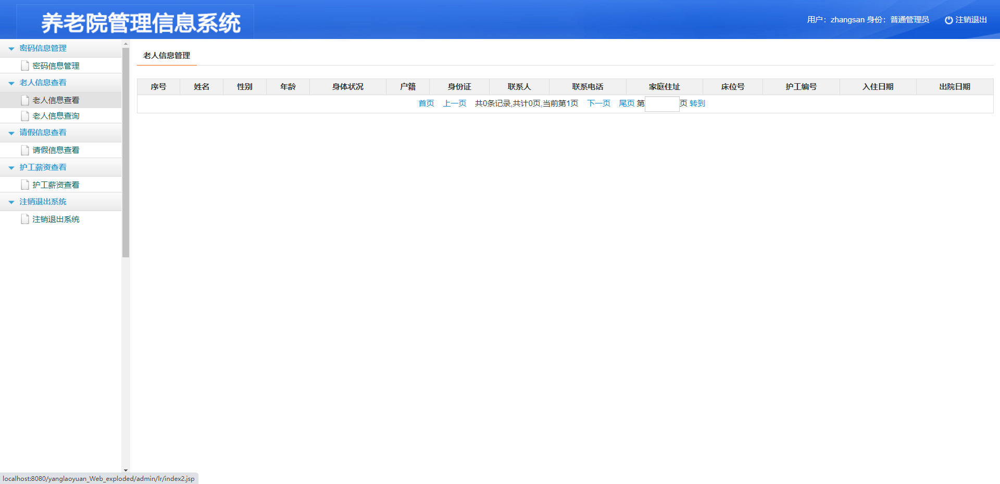
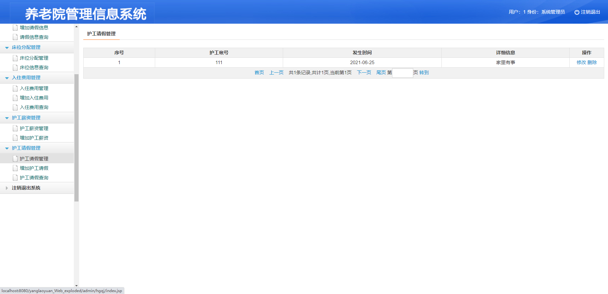

## 基于JSP+Servlet的养老院信息管理系统(程序+报告)

###  获取sql数据库文件: 从戎源码网 (https://armycodes.com/) QQ: 386869957 QQ群: 377586148
###  所有系统地址: (https://github.com/YuLin-Coder/AllProjectCatalog) 
###  所有项目以及源代码本人均调试运行无问题 可支持远程安装部署调试、定制修改、代码讲解

## 项目介绍
基于JSP+Servlet的养老院信息管理系统

系统管理员用户功能介绍：
用户管理员、员工登录、老人信息管理、床位分配管理、护工薪资管理、
护工请假记录、老人请假记录、入住费用和事故记录管理。以及对这些功能的增、删、改、查处理
普通管理员用户 （护工身份）功能介绍：
密码信息管理用例分析, 老人信息查看用例分析, 请假信息查看用例分析,
护工薪资查看用例分析

## 项目技术
- 编程语言：Java
- 数据库：MySQL
- 前端技术：JSP、JavaScript、bootstrap、JQuery
- 后端技术：Servlet、JDBC

## 运行环境
- JDK版本：JDK1.8及以上
- 开发工具：IDEA、Ecplise、Myecplise都可以
- 数据库: MySQL5.7及以上

## 运行截图

